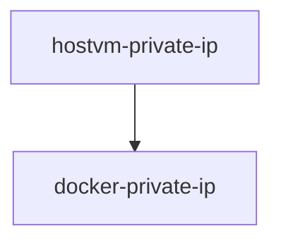
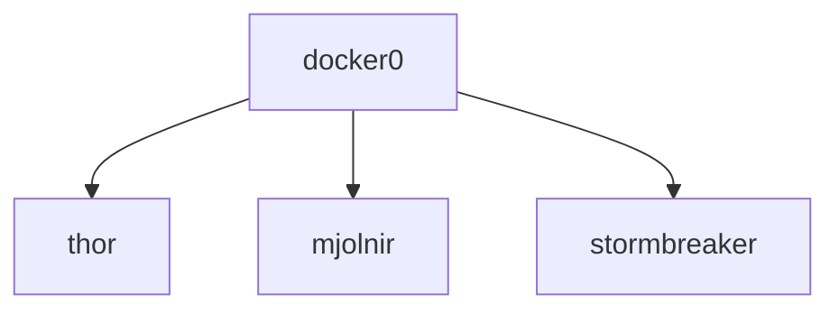
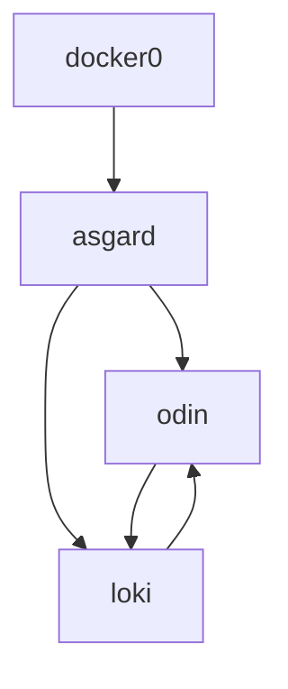
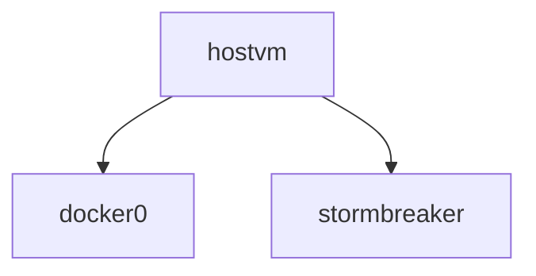
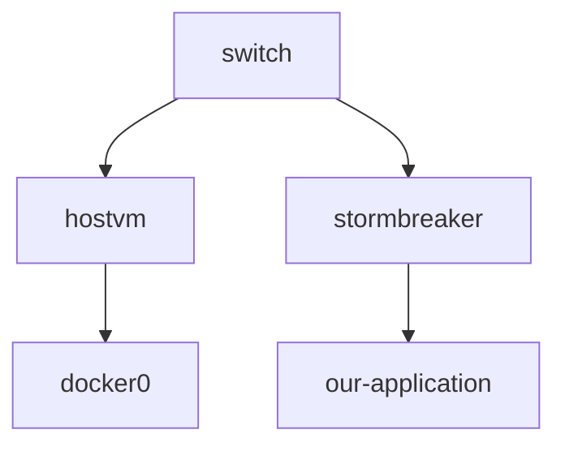

# Networking overview

Containers have networking enabled by default, and they can make outgoing connections. 

A container has no information about what kind of network it's attached to, or whether their peers are also Docker workloads or not. 

A container only sees a network interface with an IP address, a gateway, a routing table, DNS services, and other networking details. 

That is, unless the container uses the none network driver.

Drivers

* bridge, the default network driver.
* host, remove network isolation between the container and the Docker host.
* none, completely isolate a container from the host and other containers.
* overlay, overlay networks connect multiple Docker daemons together.
* ipvlan
* macvlan

https://docs.docker.com/network/

## Commands

```bash

docker network ls

docker network connect

docker network create

docker network disconnect

docker network inspect

docker network prune

docker network rm

```

https://docs.docker.com/engine/reference/commandline/network/

## NetworkChuck the 1 network, default bridge


```bash
# 7 Networks in total

# remove all and start fresh
docker compose down
docker ps -a
docker rmi -f $(docker images -aq)
# maybe you need to rm volumes also if container name is changed or hostname
# docker volume rm $(docker volume ls -qf dangling=true)
docker network ls
docker network prune

# when we installed docker we get some cool stuff
ip address show
1: [..., inet 127.0.0.1/8]
2: etho0 [...., 192.xxx.x.x/24] # private
3: docker0 [..., 172.17.0.1/16] # 

```

Bridge, default in docker, docker0



```bash
docker network ps
# default
NETWORK ID     NAME      DRIVER    SCOPE
21b05ed49511   bridge    bridge    local
16e4c0c05bc5   host      host      local
0d5aff734251   none      null      local

# network type = driver

# run some containers

# itd, interactive --rm clean up after stop
docker run -itd --rm --name thor busybox

docker run -itd --rm --name mjolnir busybox

docker run -itd --rm --name stormbreaker nginx

docker ps

CONTAINER ID   IMAGE     COMMAND                  CREATED              STATUS              PORTS     NAMES
f1619c7d14e9   nginx     "/docker-entrypoint.…"   10 seconds ago       Up 9 seconds        80/tcp    stormbreaker
80758d19600c   busybox   "sh"                     31 seconds ago       Up 30 seconds                 mjolnir
6cde086a0e73   busybox   "sh"                     About a minute ago   Up About a minute             thor

# we did not mention network, so it used the default bridge and created 3 new interfaces  and linked it to the bridge, like a switch.

ip address show

1,2,3
5: veth15ddf8d@if4
7: veth33f8184@if6
9: veth4506cea@if8

# show link
bridge link

# and we see that they are connected to docker0

5: veth15ddf8d@if4: <BROADCAST,MULTICAST,UP,LOWER_UP> mtu 1500 master docker0 state forwarding priority 32 cost 2
7: veth33f8184@if6: <BROADCAST,MULTICAST,UP,LOWER_UP> mtu 1500 master docker0 state forwarding priority 32 cost 2
9: veth4506cea@if8: <BROADCAST,MULTICAST,UP,LOWER_UP> mtu 1500 master docker0 state forwarding priority 32 cost 2

```

Bridge 3 containers connect to docker0



```bash
# the bridge also gave us ip addresses, it does DHCP, lets inspect the network
docker inspect bridge

[...]
 "Containers": {
     "Name": "thor",
     "IPv4Address": "172.17.0.2/16",
                "IPv6Address": ""
     "Name": "mjolnir",
     "IPv4Address": "172.17.0.3/16",
                "IPv6Address": ""
     "Name": "stormbreaker",
     "IPv4Address": "172.17.0.4/16",
                "IPv6Address": ""

# it copies the /etc/resolv.con from the host to the container.
# so they are using the same DNS.
# since docker atc as a switch they can all talk.

docker exce -it thor sh

# show ip
ip add
172.17.0.2/16

# ping mjolnir
ping 172.17.0.3
PING 172.17.0.3 (172.17.0.3): 56 data bytes
64 bytes from 172.17.0.3: seq=0 ttl=64 time=0.199 ms
64 bytes from 172.17.0.3: seq=1 ttl=64 time=0.153 ms

# inet  works also
ping www.ba.no
PING www.ba.no (104.18.20.60): 56 data bytes
64 bytes from 104.18.20.60: seq=0 ttl=54 time=3.164 ms

# this works since it used docker0
ip route
# docker0
default via 172.17.0.1 dev eth0

# Masquerade (hide) NAT
# Masquerade (hide) network address translation (NAT) enables you the actual address of a personal computer private. 
# NAT routes traffic from your personal computer to your system, which essentially makes the system the gateway for your personal computer.

# now the webserver, nginx use port 80
80/tcp    stormbreaker

# can we reach it on the host vm from remote ip?
# of course we have to have an inbound FW in for example Azure, but say we have that and all is in place.

http://public-ip

# no, we can not and that is one of the annoying things about the bridge network.
# you have to expose it in run or compose

sudo docker stop stormbreaker

# add port
docker run -itd --rm -p 80:80 --name stormbreaker nginx

http://public-ip

Welcome to nginx!

# view the difference
# prevoius
CONTAINER ID   IMAGE     COMMAND                  CREATED              STATUS              PORTS     NAMES
f1619c7d14e9   nginx     "/docker-entrypoint.…"   10 seconds ago       Up 9 seconds        80/tcp    stormbreaker

# current
CONTAINER ID   IMAGE     COMMAND                  CREATED              STATUS              PORTS                               NAMES
accdf38f2842   nginx     "/docker-entrypoint.…"   About a minute ago   Up About a minute   0.0.0.0:80->80/tcp, :::80->80/tcp   stormbreaker


# annoying on home lab, but it is good for is:
# isolation
```


## NetworkChuck the 2 network, user-defined bridge for production

```bash
# speaking of isolation
# bridge is cool, but use this instead, docker wants that.

sudo docker network create asgard
# or in compose

# get the new bridge, 172.18, not 17
ip address show
12: [..., 172.18.0.1/16]

# view it
docker network ls

NETWORK ID     NAME      DRIVER    SCOPE
81f4cb96a0be   asgard    bridge    local
21b05ed49511   bridge    bridge    local
16e4c0c05bc5   host      host      local
0d5aff734251   none      null      local

# add containers
docker run -itd --rm --network asgard --name loki busybox
docker run -itd --rm --network asgard --name odin busybox

ip address show

bridge link

5: veth15ddf8d@if4: <BROADCAST,MULTICAST,UP,LOWER_UP> mtu 1500 master docker0 state forwarding priority 32 cost 2
7: veth33f8184@if6: <BROADCAST,MULTICAST,UP,LOWER_UP> mtu 1500 master docker0 state forwarding priority 32 cost 2
11: vethc54447c@if10: <BROADCAST,MULTICAST,UP,LOWER_UP> mtu 1500 master docker0 state forwarding priority 32 cost 2
14: veth7ca5272@if13: <BROADCAST,MULTICAST,UP,LOWER_UP> mtu 1500 master br-81f4cb96a0be state forwarding priority 32 cost 2
16: veth508b690@if15: <BROADCAST,MULTICAST,UP,LOWER_UP> mtu 1500 master br-81f4cb96a0be state forwarding priority 32 cost 2

# inspect it
docker inspect asgard

 "Containers": {
      "Name": "odin",
       "IPv4Address": "172.18.0.3/16",
                "IPv6Address": ""
      "Name": "loki",
       "IPv4Address": "172.18.0.2/16",
                "IPv6Address": ""
    

# why do this, isolation
# odin, loki cannot talk to thor.....

# you also get some cool DNS with this, enter loki
docker exec -it loki sh

# ping odin
ping odin
PING odin (172.18.0.3): 56 data bytes
64 bytes from 172.18.0.3: seq=0 ttl=64 time=0.143 ms

# how about that, since ip addresses can change, you can use DNS


```

user-defined bridge for production with DNS



## NetworkChuck the 3 network host

```bash
# is was the default network
# redeploy the webserver
docker stop stormbreaker

# leave out ports but specify host network

docker run -itd --rm --network host --name stormbreaker nginx

# stormbreaker is moved to host, he has nothing, he shares it with the host
http://public-ip

Welcome to nginx!

# it runs as an application, but no isolation.


```
host



## NetworkChuck the 4 network mac-vlan

```bash
# macvlan
# remove all and connect containers to the physicall network
# it would be like conecting thor and mjolnir to the switch
# own ip address and mac, they are acting like virtual machines.

docker network create -d macvlan \
--subnet yoursubnet \ 
--gateway yourgateway \
-o parent=enp0s3 \
newasgard

# -o, tie macvlan to a your physical nic

# we we do docker run, we have to assign ip address ourselfs
docker run -itd --rm --network newasgard --ip yoursubnet-ip-select --name this busybox

# This is amazing but, we also get a mac address for each container.
# Issue with ping for example
# you
# have to enable promisc mode
# pain....the next network is better

```
macvlan


## NetworkChuck the 5 network

```bash
```

## NetworkChuck the 6 network

```bash
```

## NetworkChuck the 7 network

```bash
```

https://www.youtube.com/watch?v=bKFMS5C4CG0&t=844s

Lets use the rabbitmq x 2 with shovel containers